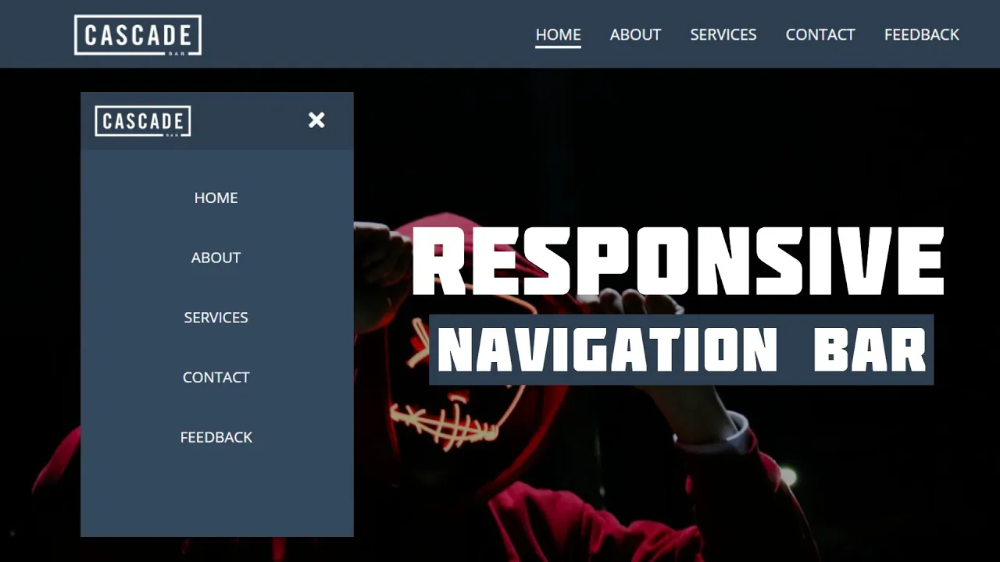

# Responsive Navigation Menu Bar


[](https://www.youtube.com/watch?v=AkK8yHC4TlI)




## Tabela de conteúdos

<!--ts-->

- [Sobre o projeto](#-sobre-o-projeto)
- [Tecnologias](#-tecnologias)
  - [Website](#website)
  - [Utilitários](#utilitários)
- [Como executar o projeto](#-como-executar-o-projeto)
  - [Pré-requisitos](#pré-requisitos)
  - [Abrindo direto no navegador](#abrindo-direto-no-navegador)
  - [Acessando via VSCode](#acessando-via-vscode)
- [Licença](#-licença)
<!--te-->

## 💻 Sobre o projeto

Responsive Navigation Menu Bar é um projeto que utiliza apenas HTML e CSS para criar um menu responsivo e simples para sites.

Para saber como foi realizado, acesse o [vídeo](https://www.youtube.com/watch?v=AkK8yHC4TlI) do canal [CodingNepal](https://www.youtube.com/@CodingNepal) no YouTube.

## 🛠 Tecnologias

As seguintes ferramentas foram usadas na construção do projeto:

#### **Website**

- HTML
- CSS

#### **Utilitários**

- Editor: **[Visual Studio Code](https://code.visualstudio.com/)** → Extensions: **[Live Server](https://marketplace.visualstudio.com/items?itemName=ritwickdey.LiveServer)**
- Ícones: **[CDNJS - Font Awesome ](https://cdnjs.cloudflare.com/ajax/libs/font-awesome/6.4.0/css/all.min.css)**
- Fontes: **[Open Sans](https://fonts.google.com/specimen/Open+Sans)**

## 🚀 Como executar o projeto

### Pré-requisitos

Clone este repositório:

```bash
$ git clone https://github.com/nathaliaveneziano/responsive-navigation-menu-bar.git
```

Acesse a pasta do projeto no terminal:

```bash
$ cd responsive-navigation-menu-bar
```

### **Abrindo direto no navegador**

Basta clicar diretamento no arquivo `index.html` e abra no seu navegador de prefe6encia.

### **Acessando via VSCode**

Abra o projeto no VSCode, caso queira abrir via terminal, só colocar o seguinte comando:

```bash
$ code .
```

Com o projeto aberto, rode o Live Server para ver o projeto em tempo real. Existem 3 formas de rodar o Live Server:

- Clique na barra inferior direita em `Live Server`
- Botão direito no arquivo `index.html` e selecione `Open with Live Server`
- Através do atalho ALT+L ALT+O

Será aberta uma nova guia no seu navegador de preferencia, normalmente ele abre em `http://localhost:5500/`.

## 📝 Licença

Este projeto esta sobe a licença [MIT](./LICENSE).

Feito com ❤️ por Nathália Veneziano 👋🏽 [Entre em contato!](https://www.linkedin.com/in/nathalia-veneziano)
